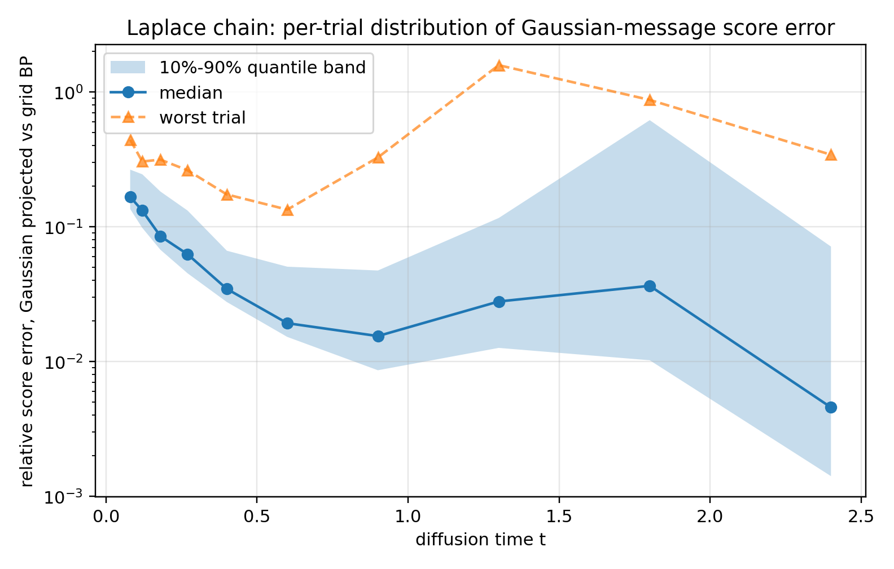

# Belief Propagation for Diffusion Scores on Markov Chains

From the exactly-solvable **Gaussian AR(1)** baseline to **general (non-Gaussian) Markov
chains**, this repo derives and numerically studies belief propagation (BP) as a way of
computing the diffusion score

$$
s_i(x,t) = \partial_{x_i} \log p_t(x) = -\frac{x_i - \alpha_t\, m_i(x,t)}{\Delta_t},
\qquad m_i(x,t) = \mathbb{E}[a_i \mid x_{1:n}],
$$

for a clean Markov chain $a_{1:n}$ observed through OU noising
$x_i = \alpha_t a_i + \sqrt{\Delta_t}\, z_i$, $\alpha_t = e^{-t}$, $\Delta_t = 1-e^{-2t}$.

**📄 Start here: [`summary_note/bp_diffusion_score_summary.pdf`](summary_note/bp_diffusion_score_summary.pdf)** — a 5-page summary of all results.

## Repo structure

| Folder | Content |
|--------|---------|
| [`gaussian_ar1/`](gaussian_ar1/) | **Part I.** Full derivation (PDF + LaTeX) and implementation of Gaussian BP for the AR(1) chain, checked against the exact precision-matrix score $-\Sigma_t^{-1}x$. |
| [`markov_gaussian_approx/`](markov_gaussian_approx/) | **Part II.** Generalization to arbitrary Markov chains: report, grid BP + Gaussian-projected BP implementations, experiments on a Laplace-innovation chain, and heavy validation runs. |
| [`summary_note/`](summary_note/) | Brief summary note (LaTeX + compiled PDF) of the combined results. |

## Part I — Gaussian AR(1): the solvable baseline

Two mathematically equivalent routes to the score: direct linear algebra
($s = -\Sigma_t^{-1}x$) and Gaussian BP in information form (posterior denoiser →
score). They agree at machine precision:

```
max |score_BP - score_matrix| ≈ 6.7e-16   (n=40, ρ=0.7, t=0.8)
```

Details: [`gaussian_ar1/bp_gaussian_ar1_diffusion.pdf`](gaussian_ar1/bp_gaussian_ar1_diffusion.pdf).

## Part II — General Markov chains: what does Gaussian closure cost?

On a chain, BP is *exact* for any Markov prior — the issue is that non-Gaussian messages
are infinite-dimensional (whole functions). Two implementations are compared:

- **Reference grid BP** — messages on a grid, numerically exact once converged;
- **Gaussian projected BP** — every message is moment-matched back to a Gaussian
  (assumed-density filtering), isolating exactly the error of *Gaussian message closure*.

Test model: AR(1) chain with **Laplace innovations** ($\rho = 0.85$, $n = 50$, unit variance).

### Heavy-run results (`markov_gaussian_approx/outputs_heavy/`)

**The reference is trustworthy.**
- Gaussian control (grid BP vs exact matrix score, 48 trials/t): relative error ~1e-16–1e-14 at all $t$.
- Laplace grid convergence ($M=401$ vs $801$): ≤ 6e-6 — orders of magnitude below the effect being measured.

**The price of Gaussian message closure** (relative score error vs reference grid BP):

| $t$ | closure error | trend |
|------|--------------|-------|
| 0.08 | **~21%** | systematic: *all* 100 trials exceed 10% |
| 0.18 | ~9% | decaying |
| 0.40 | ~4% | decaying |
| 0.90 | ~1% | noisy marginal has Gaussianized |
| 1.30 | ≲1% | at the numerical floor |

- **Small $t$ (near the data) is where Gaussian closure hurts**: the denoiser error is
  amplified by $\alpha_t/\Delta_t \sim 1/(2t)$ in the exact identity — precisely the regime
  that matters for generation. Score *direction* survives better (cosine ≥ 0.98).
- **Large $t$**: an independent finding — naive moment-matching on grids becomes
  numerically unstable when messages go flat ($\alpha_t^2/\Delta_t \to 0$), with rare
  catastrophic failures *even in the pure-Gaussian control* (worst case: belief displaced
  from $-0.29$ to $+6.1$). Information-form / natural-parameter updates (as in Gaussian BP
  and AMP) do not suffer from this — a numerical argument for AMP-style parametrizations.



## Reproduce

```bash
pip install -r requirements.txt

# Part I
cd gaussian_ar1 && python bp_gaussian_ar1_diffusion.py --n 40 --rho 0.7 --t 0.8

# Part II (report-quality run)
cd markov_gaussian_approx/code
python bp_general_markov_diffusion_experiments.py --mode report --n-trials 48 --output-dir ../outputs_reproduced
python per_trial_error_analysis.py --n-trials 100 --output-dir ../outputs_reproduced/per_trial
```

Heavy-run configurations used here (see `markov_gaussian_approx/outputs_heavy/heavy_log.txt`):
48 trials/t main run, fine-grid check (ref $M=801$), wide-grid check ($[-12,12]$), and
100-trials/t per-trial distribution analysis.

## References

- G. Biroli and M. Mézard. *Generative diffusion in very large dimensions.* arXiv:2306.03518, 2023.
- M. Mézard. *Generative diffusion — updated notes.* Lecture notes, 2025.
- M. Mézard and A. Montanari. *Information, Physics, and Computation.* Oxford University Press, 2009.
- G. Genovese and A. Piana. *Derivation of the AMP equations from belief propagation for the $\ell_2$ minimisation problem.* arXiv:2602.15191, 2026.
